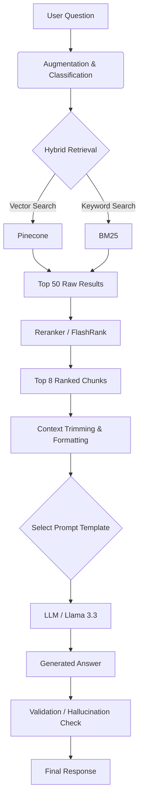

# LLM Service Module Report: Search, Retrieval & Generation

This report details the architecture of the **LegalRAG** service module (`rag_chain.py`), focusing on how user questions are processed, how legal articles (chunks) are retrieved, and how the final answer is generated by the Large Language Model (LLM).

## 1. Architecture Overview

The core logic resides in `rag_chain.py`, which implements a **Retrieval-Augmented Generation (RAG)** pipeline. The process follows these stages:

1.  **Query Preprocessing**: Augmentation and keyword extraction.
2.  **Hybrid Retrieval**: Combining semantic search (Pinecone) with keyword search (BM25).
3.  **Re-ranking**: Re-ordering results using a cross-encoder (FlashRank).
4.  **Context Trimming**: Selecting and shortening the most relevant chunks.
5.  **Prompt Engineering**: Selecting the appropriate prompt template (Universal, Criminal, or Range).
6.  **LLM Generation**: Sending the context and query to the model (Groq/Llama 3.3 or Ollama).
7.  **Answer Validation**: Checking if the answer is grounded in the retrieved sources.

---

## 2. Retrieval Process (Chunks & Articles)

The retrieval system is designed to find relevant legal articles from the 19 indexed codes.

### A. Query Augmentation (`_augment_retrieval_query`)
Before searching, the user's query is analyzed to add relevant legal keywords. This increases recall for specific legal concepts that a user might describe in layman's terms.

*   **Synonym Injection:**
    *   "подмена ребенка" $\rightarrow$ adds "статья 136 УК РК".
    *   "финансовая пирамида" $\rightarrow$ adds "217 УК РК".
    *   "врачебная ошибка" $\rightarrow$ adds "317 УК РК".
*   **Article Range Extraction:**
    *   If the user asks about "articles 120-125", the system explicitly adds "статьи 120 121 122... УК РК" to the search query to ensure all articles in the range are candidates for retrieval.

### B. Hybrid Search Strategy
The system uses an `EnsembleRetriever` to combine two search methods:

1.  **Semantic Search (Pinecone):**
    *   **Model:** `multilingual-e5-large` (via Hugging Face).
    *   **Mechanism:** Converts the query into a vector and finds semantic matches in Pinecone.
    *   **Weight:** ~40% (Configurable via `VECTOR_WEIGHT`).
    *   **Pros:** Finds concepts conceptually related even if words don't match exactly.

2.  **Keyword Search (BM25):**
    *   **Mechanism:** Traditional probabilistic search based on exact keyword matching.
    *   **Weight:** ~60% (Configurable via `BM25_WEIGHT`).
    *   **Pros:** Critical for finding specific article numbers (e.g., "Article 136") or precise legal terms.

### C. Advanced Filtering
*   **Filters:** Can filter by specific Code (e.g., `code_ru="УК РК"`) or Article Number if specified in environment variables or detected in the query.
*   **Criminal Code Bias:** `_LawAwareRetriever` ensures that if a query is regarding a crime, at least `min_k_criminal` (default 12) documents from the Criminal Code are retrieved, even if other codes match better initially.

### D. Re-ranking (FlashRank)
After initial retrieval (top ~50 docs), the results are re-ranked using a cross-encoder model:
*   **Model:** `ms-marco-MiniLM-L-12-v2` or `rank-T5-flan`.
*   **Purpose:** The cross-encoder reads explicitly the query and the document pair to score relevance much more accurately than the vector dot product.
*   **Result:** The top 8 most relevant chunks are selected for the LLM context.

---

## 3. LLM Interaction (Generation)

Once the relevant chunks are selected, they are formatted into a prompt and sent to the LLM.

### A. Context Construction
*   **Chunk Limit:** Max 8 documents (`CONTEXT_MAX_DOCS`).
*   **Length Limit:** Max 1800 characters per document (`CONTEXT_MAX_CHARS_PER_DOC`). Long articles are truncated to ensure the prompt fits within the LLM's context window.
*   **Source Citation:** Each chunk in the context includes metadata: `Source` (filename), `Code Name`, and `Article Number`, allowing the LLM to cite its sources accurately.

### B. Prompt Templates
The system dynamically selects a prompt based on the query type:

1.  **`UNIVERSAL_PROMPT` (Default):**
    *   Strict instruction to answer **only** from the context.
    *   Mandatory disclaimer: "Это не официальная юридическая консультация..."
    *   Rules for citation: "Article X, Code Y".

2.  **`CRIMINAL_PROMPT` (Specialized):**
    *   Used when the query involves crimes or the Criminal Code.
    *   Forces a structured response:
        1.  **Object** of the crime.
        2.  **Objective Side** (act).
        3.  **Subject** (who commits it).
        4.  **Subjective Side** (intent).

3.  **`RANGE_PROMPT`:**
    *   Used when asking about a range of articles (e.g., "What is in articles 100-110?").
    *   Instructs the LLM to list and summarize all articles in the range found in the context.

### C. Model Execution
*   **Primary Backend (Groq):** Uses **Llama 3.3 70B Versatile**. This model is chosen for its high reasoning capability and speed (via Groq LPU).
    *   Temperature: 0.0 (Deterministic).
    *   Max Tokens: 2048.
*   **Fallback Backend (Ollama):** Can run locally with models like `llama3.1:8b` if internet or API keys are unavailable.

---

## 4. Code & Configuration Reference

*   **`rag_chain.py`**:
    *   `_augment_retrieval_query`: Logic for adding keywords.
    *   `invoke_qa(query)`: Main entry point receiving the user question.
    *   `_make_embeddings`: Loads the Hugging Face embedding model.
    *   `_LawAwareRetriever`: Custom retriever class for Criminal Code logic.
*   **`config.py`**:
    *   `ADILET_SOURCES`: List of the 19 legal codes indexed.
    *   `PINECONE_INDEX_NAME`: Database configuration.
    *   `LLM_MODEL`: Model selection (`llama-3.3-70b-versatile`).

## 5. Summary Flowchart

